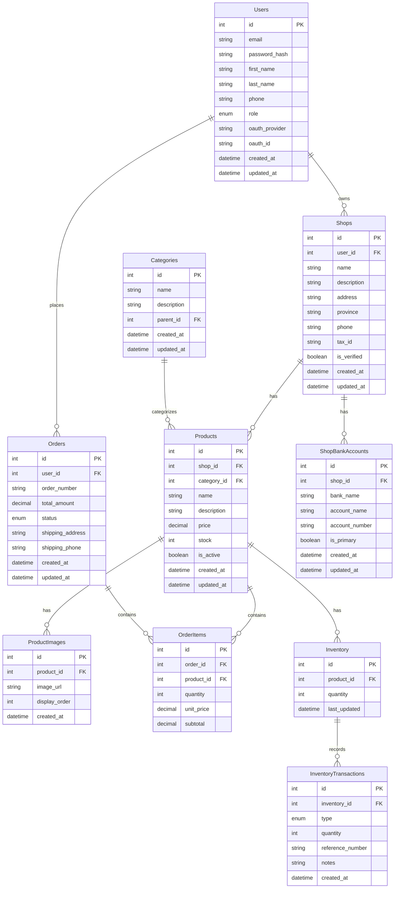

# OTOP STORE

## Entities Relations Diagrams

```mermaid
erDiagram
    Users ||--o{ Shops : owns
    Users ||--o{ Orders : places
    Users {
        int id PK
        string email
        string password_hash
        string first_name
        string last_name
        string phone
        enum role
        string oauth_provider
        string oauth_id
        datetime created_at
        datetime updated_at
    }

    Shops ||--o{ Products : has
    Shops ||--o{ ShopBankAccounts : has
    Shops {
        int id PK
        int user_id FK
        string name
        string description
        string address
        string province
        string phone
        string tax_id
        boolean is_verified
        datetime created_at
        datetime updated_at
    }

    Products ||--o{ ProductImages : has
    Products ||--o{ OrderItems : contains
    Products ||--o{ Inventory : has
    Products {
        int id PK
        int shop_id FK
        int category_id FK
        string name
        string description
        decimal price
        int stock
        boolean is_active
        datetime created_at
        datetime updated_at
    }

    Categories ||--o{ Products : categorizes
    Categories {
        int id PK
        string name
        string description
        int parent_id FK
        datetime created_at
        datetime updated_at
    }

    ProductImages {
        int id PK
        int product_id FK
        string image_url
        int display_order
        datetime created_at
    }

    Orders ||--o{ OrderItems : contains
    Orders {
        int id PK
        int user_id FK
        string order_number
        decimal total_amount
        enum status
        string shipping_address
        string shipping_phone
        datetime created_at
        datetime updated_at
    }

    OrderItems {
        int id PK
        int order_id FK
        int product_id FK
        int quantity
        decimal unit_price
        decimal subtotal
    }

    Inventory ||--o{ InventoryTransactions : records
    Inventory {
        int id PK
        int product_id FK
        int quantity
        datetime last_updated
    }

    InventoryTransactions {
        int id PK
        int inventory_id FK
        enum type
        int quantity
        string reference_number
        string notes
        datetime created_at
    }

    ShopBankAccounts {
        int id PK
        int shop_id FK
        string bank_name
        string account_name
        string account_number
        boolean is_primary
        datetime created_at
        datetime updated_at
    }
```